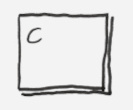

# nexus-lang

[](./LICENSE)
[](CODE_OF_CONDUCT.md)
[](https://github.com/krisvanrens/nexus-lang/actions)

The Nexus programming language.

Nexus is a programming language for describing component network descriptions.
Aside a simple base of common general-purpose primitives/control flow/etc. it offers native integration for building a network of components, connecting in-/outputs and setting component properties.
The goal of Nexus is to strike a balance between a full-fledged programming language and a declarative network description language.

Nexus is meant to drive another component-network-oriented network system through its API, using the Nexus network description as input.

The syntax and most semantics of Nexus are loosely modeled after that of the [Rust programming language](https://github.com/rust-lang/rust).

**NOTE**: This project is still very much under construction -- anything might change!

## Native integration with component networks

Nexus is designed to interface component-network-oriented systems.

Consider this example network:


This network can be implemented using the following code:

```rust
// Instantiate components:
let c1 = node "Source";
let c2 = node "Sink";

let mut system : group; // A component group named 'system'.
system.source = c1;
system.sink = c2;

let system.processor = node "Converter"; // Ad-hoc definitions.

// References to entities:
let proc = &system.processor;

// Create an immutable node property:
let proc.threshold = 3.14;

// Operators for defining node in-/output connections:
c1.Output -> system.processor.Input;
system.processor.Output -> c2.Input;
```

### Nodes, properties, connections and groups

A component network is described in terms of four elementary parts:

- **Nodes** (i.e. component instantiations),
- **Node properties**,
- **Connections** (between node in-/outputs),
- **Groups** (i.e. collections of nodes).

Each of these parts can be expressed using Nexus.

#### Nodes

To instantiate a component (i.e. create a node) of type `Converter`:

```rust
let c = node "Converter";
```

The local handle `c` can be used to address the node within Nexus (e.g. for creating a connection).

#### Node properties

To set a node property, simply add ad-hoc definitions:

```rust
let c = node "Converter";

let c.rate     = 10;
let c.profile  = "baseline";
let c.clipping = true;
```

Properties can be primitive types (i.e. booleans, numbers or strings).

#### Connections

To create a connection between nodes, the `->` operator can be used:

```rust
let ingest = node "Source";
let egest  = node "Sink";

ingest.output -> egest.input;
```

This will connect edge `output` of the node typed `Source` to edge `input` of the node typed `Sink`.
Nexus does not distinguish between in- or outputs, and will ad-hoc assume the presence of any used edges.

Edges are directional (i.e. `source -> destination`), but it is up to the system consuming the network description to deal with this (or ignore this property).

#### Groups

To organize nodes hierarchically, groups can be defined:

```rust
let ingest = group "In";
let egest  = group "Out";

// Ingest subsystem:
let ingest.source  = node "Source";
let ingest.convert = node "Converter";

ingest.source.out -> ingest.convert.in;

// Egest subsystem:
let egest.convert = node "Converter";
let egest.sink    = node "Sink";

egest.convert.out -> egest.sink.in;

// Connect both subsystems:
ingest.convert.out -> egest.convert.in;
```

## Simplicity

Nexus is geared towards simplicity, in the sense that it tries to support a minimal viable set of features required for flexible use as a component network description language.

That's the reason why, at least for now, it is agnostic of component types, in-/output types or validity of connections/properties/etc.
Just to name a few.
It is up to the downstream application consuming the component network to check validity on a higher level.

Perhaps as this project matures, more advanced concepts will be modeled by Nexus itself.

## Safety

Nexus is opinionated in some respects, mostly to improve language safety.
The following subsections indicate in what specific ways.

### Using a value uninitialized is an error

Even though Nexus is dynamically typed, it requires a value to be initialized when it's used.
E.g.:

```rust
let x;

let y = x; // Error: Using 'x' uninitialized.
```

and:

```rust
let mut x;

x = true;

let y = x; // OK.
```

### Block scope braces are strictly required

Braces after `if`/`while`/`for`/etc. expressions are strictly required.
E.g.:

```rust
// Error: no block scope braces.
if expr
    do_something();

// OK.
if expr {
    do_something();
}
```

Explicit scope limiting increases esthetic consistency, as well as maintainability.

## Tooling

One of the focus points of Nexus is that there should be good tooling.
This has many aspects:

- Nexus should be friendly for building tools for; the API should be simple.
- Nexus should (on the long run) be delivered with tools and examples.

## Documentation and tests

As soon as the language syntax and semantics settle, documentation will be added.
The current leading implementation of Nexus, `nexus_rs` will be documented and tested thoroughly.

## The component model

This section describes the abstract component model used to define networks for.

### Operations

The end result of a Nexus program is a component network, described in terms of four fundamental operations:

| Operation | Diagram |
| --------- | ------- |
| Component instantiation           |          |
| Component property definition     |      |
| Component in- / output connection |  |
| Component group definition        |            |

Because Nexus itself only deals with these simple operations, it is up to the higher-level processing to deal with further validation of the resulting component network.
These validation checks might include:

- Checking for nonexistent component types,
- Checking for nonexistent component in- / outputs,
- Checking for invalid component properties,
- Checking for incompatible component in- / output connections,
- ...

### Network model

The resulting component network is modelled as a tree hierarchy, starting from a virtual root node.

For example, consider this network:


This would lead to the network definition:

```text
root.c1
root.g1.c2
root.g1.c3
root.g2.c4
root.c5
```

Here `c1`..`c5` are component instantiations, `g1` and `g2` are component groups.

## Language API

This section describes the API used to interact with a software component network description system.
It can also be used by other tools, e.g. a visualizer for networks described by Nexus.

`// TODO`

## Language backend-end API / FFI

..how should software component networks interact with Nexus?

## Examples

### Example 1: general purpose

```rust
// Comment.
fn free(a: Number, b: bool, c: Number) -> Number {
    42 + a + if b { c } else { 0 }
}

/* Comment */
fn main() {
    fn local1() {
        return "Hello1".len();
    }

    let local2 = ||{ return "Hello2".len(); };

    let x = free(1, true, local1() + local2());

    print |x|{ 17 + x }(); // IIFE.
}
```

### Example 2: graph description

```rust
fn create_system(name: String) -> group {
    let mut sys = group(name);

    let sys.source = node "Reader";
    let sys.sink = node "Writer";

    sys.source.Output -> sys.sink.Input;

    // Group in-/outputs:
    let sys.Input = &sys.source.Input;
    let sys.Output = &sys.sink.Output;

    sys
}

let mut app : group;

// Create four systems in 'app':
for i in 0..4 {
    app[i] = create_system("Sys" + i);
}

print app;
```

## Feature list

### Fundamental data types

Nexus is dynamically typed.
All automatic variables are declared using `let` (immutable, directly initialized) or `let mut` (mutable) and are typed according to first initialization.
After first use, the type is strictly checked.
Function arguments are always strictly typed.

There are three fundamental data types:

- `String`, a Unicode string,
- `Number`, a double-precision (> 64 bits), signed floating-point number,
- `bool`, a boolean logic value.

### Expressions

- Loop: `while`/`for`
- Conditional: `if`
- Closure: `|x|{ /* ... */ }`
- Range: `x..y` (exclusive) or `x..=y` (inclusive)

### Statements

- Declaration: `let`
- Function: `fn`
- Return: `return`
- Print: `print`
- Expression statements

## Implementation status

### Milestone 0: ideation, base setup (v0.1)

- [x] Lexing/scanning setup.
- [x] Scanner error handling.
- [x] Interpretation from source file (`.nxs`).
- [x] Command-line REPL setup.

### Milestone 1: language setup (v0.2)

- [x] First thorough iteration of grammar rules.
- [x] Parsing setup.
- [ ] Parsing error handling.
- [ ] Debugging commands in REPL and interpreter.

### Milestone 2: foundations (v0.3)

- [ ] Setup interpretation.
- [ ] Setup identifier resolving and scope handling.
- [ ] Simple arithmetic expressions.
- [ ] Printing of values.

### Milestone 3: basics (v0.4)

- [ ] Including other files with `use`
- [ ] Functions using `fn`.
- [ ] ...

T.B.D.

## Keywords

### Language type keywords

| Keyword | Description |
| :-----: | :---------- |
| `Group`  | Component group.    |
| `Node`   | Component.          |
| `Number` | Number type.        |
| `String` | String type.        |
| `bool`   | Boolean logic type. |

### Base language keywords

| Keyword | Description |
| :-----: | :---------- |
| `const`  | Constant declaration.          |
| `else`   | Conditional expression.        |
| `fn`     | Function declaration.          |
| `for`    | Loop expression.               |
| `if`     | Conditional expression.        |
| `in`     | Part of `for` loop syntax.     |
| `let`    | Variable declaration.          |
| `mut`    | Variable mutability specifier. |
| `return` | Return statement.              |
| `use`    | External use statement.        |
| `while`  | Loop expression.               |

### Language library keywords

| Keyword | Description |
| :-----: | :---------- |
| `group` | Component group instantiation. |
| `node`  | Component instantiation.       |
| `print` | Print expression result.       |

## Language grammar

Productions are in [Extended Backus-Naur Form (EBNF)](https://en.wikipedia.org/wiki/Extended_Backus%E2%80%93Naur_form) (the [W3C form used for XML](https://www.w3.org/TR/xml/#sec-notation), to be specific).

### Lexical grammar

```ebnf
ALPHA  = [a-zA-Z] | '_' ;
DIGIT  = [0-9] ;
STRING = '"' ( ? any character - '"' ? )* '"' ;
NUMBER = DIGIT+ ( '.' DIGIT+ )? ;
ID     = ALPHA ( ALPHA | DIGIT )* ;
```

> **NOTE**: for simplicity in the production rules, `ALPHA` is represented here as ASCII alphabetic.
However, in `nexus-rs`, it means any *alphabetic* character, as defined by [chapter 4](https://www.unicode.org/versions/Unicode15.0.0/ch04.pdf) of [Unicode standard](https://www.unicode.org/versions/Unicode15.0.0/).
This means in practice it is possible to define identifiers named '`ŮñĭçøƋɇ`'.

### Main syntax (WIP)

```ebnf
program    = decl* EOF ;

decl       = fn_decl | const_decl | var_decl | use_decl | stmt ;
fn_decl    = 'fn' function ;
const_decl = 'const' ID ':' type '=' expr ';' ;
var_decl   = 'let' ( 'mut' )? ID ( ( '=' expr ) | ( ':' type ) ( ':' type '=' expr ) )? ';' ;
use_decl   = 'use' expr ';' ;

stmt       = expr_stmt | assignment | connect | print | return | block ;
expr_stmt  = expr ( ';' )? ;
assignment = ID '=' ( expr | ref ) ';' ;
connect    = ID '->' ID ';' ;
print      = 'print' expr? ';' ;
return     = 'return' expr? ';' ;
block      = '{' decl* '}' ;

expr       = primary | unary | binary | range_expr ;
primary    = call | ID | literal | closure | control | group | block ;
call       = ID '(' args ')' ;
literal    = NUMBER | STRING | 'true' | 'false' ;
closure    = ( '||' | '|' args '|' ) ( '->' type )? ( expr | block ) ;
control    = if | while | for ;
group      = '(' expr ')' ;
if         = "if" expr block ( "else" ( if | block) ) ;
while      = "while" expr block ;
for        = "for" ID "in" ( ( range_expr ) | ID ) block ;
unary      = ( '!' | '+' | '-' | 'group' | 'node' ) expr ;
operator   = eq_ops | rel_ops | logic_ops | arith_ops | dot ;
eq_ops     = '==' | '!=' ;
rel_ops    = '<=' | '>=' | '<' | '>' ;
logic_ops  = '||' | '&&' ;
arith_ops  = '+' | '-' | '*' | '/' | '%' ;
dot        = '.' ;
binary     = expr operator expr ;
range_expr = ( literal | ID | group ) '..' ( '=' )? ( literal | ID | group ) ;

ref        = '&' ID ;
function   = ID '(' params* ')' ( '->' type )? block ;
params     = ID ':' type ( ',' ID ':' type )* ;
args       = expr ( ',' expr )* ;
type       = 'bool' | 'Node' | 'Group' | 'Number' | 'String' ;
```

> **NOTE**: the grammar will be extended as the language implementation progresses.

#### Glossary

| Abbreviation | Meaning |
| :----------: | :------ |
| `decl` | Declaration |
| `expr` | Expression  |
| `ops`  | Operations  |
| `stmt` | Statement   |

#### Operator precedence

Operator precedence ordering is similar to Rust and C/C++ precedence levels.

Precedence levels from *high to low* in order:

| Operators | Associativity | Description |
| :-------: | :-----------: | :---------- |
| `.` `x()`         | Left-to-right | Member access, functional call |
| `!` `+` `-`       | Right-to-left | Unary operators                |
| `*` `/` `%`       | Left-to-right | Factor operators               |
| `+` `-`           | Left-to-right | Addition and subtraction       |
| `<` `<=` `>=` `>` | Left-to-right | Relational operators           |
| `==` `!=`         | Left-to-right | Equality operators             |
| `&&`              | Left-to-right | Logical AND operator           |
| `\|\|`            | Left-to-right | Logical OR operator            |
| `..` `..=`        | Left-to-right | Range definitions              |

## Known limitations

- Due to the current line-based scanning implementation, only a single scanning error per line will be detected. This is fine for now.

## TODO

- Improve declarative approach for extending a module with components.
- Simple support for variable aliases (references)? Should be handy for shorthand names.
- Immutability? Is the benefit of immutability by default + move semantics beneficial for the use case of Nexus? Why or why not?
- Support for objects? Groups using `group` should suffice.
- Execution entry point? Just structural starting from the root `.nxs` file? No. An end result object or function entry point is required.
- Object literal notation? (or JSON literal notation)
- Add `match` expression? Should be relatively simple for a few fundamental types.
- Handling setting of component values...how/what/mutability?
- Implicit return value (to omit `return` in most places)?
- Add compound assignment/operators (`+=`/`-=`/`*=`/`/=`/`%=`).
- Traits for fundamental types? E.g. `"blah".len() == 4` etc.
- Is it possible to have `Number` be floating-point when sometimes used as integer?
- Error handling? Result types? Not now.
- Support for integration into a visual IDE / generative tooling.
- Require safe edge types? How? Should be dealt with in the API -- possibly a responsibility of the component network integration.
- Provide clear and good error messages on every level.
- FFI? How to deal with FFI of rich Unicode strings? Allow Unicode in Nexus, but restrict to ASCII over FFI boundaries?
- Add `loop` expression? This will also require `break` and `continue` (which would be nice anyway..).
- What is the difference between the front- and backend API? Is there a difference at all? What are the needs for a visualization tool vs. those of the component network integration itself?
- Tool idea: Nexus to Graphviz Dot description.
- Example integrations and implementations. Nexus to Rust library, Nexus to C++ library etc.
- Shadowing like Rust does?
- Enforce style: upper snake case for `const`?
- Function order is arbitrary like Rust?
- `if` expressions *must* be of type `bool`.
- `else if` support.
- Printing of `group`s and `node`s.
- Generating an AST graph image for debugging.
- Underscore for integer number separators?
- Underscore for unused variables?
- Are `node` and `group` really unary operators?
- Array and subscript operators? Is it possible to implement this using `Groups` somehow?

## FAQ

### Why the name?

From the dictionary:

> **Nexus**; *nex·us*; meaning: *connection, link*

Of course this ties back to its place as a component network-description language.

### Why hand-code all the parsing etcetera?

Yes.
I know.
There's excellent crates like [`syn`](https://github.com/dtolnay/syn) (for parsing Rust code) and [`pest`](https://github.com/pest-parser/pest) (for writing parsers), and probably many more.
But a large part of the fun of coding up homegrown projects like this is that it's OK to write most of it yourself, learning from the process and enjoying it!
